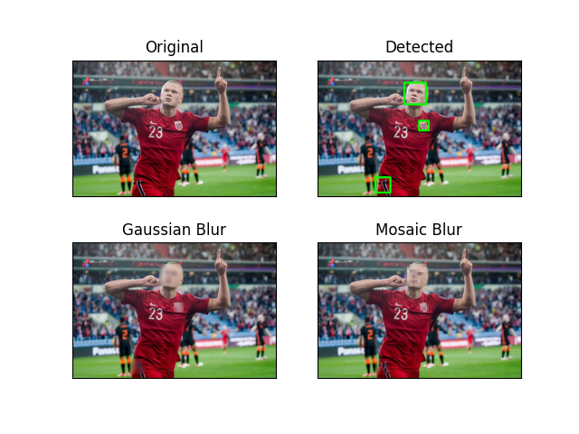
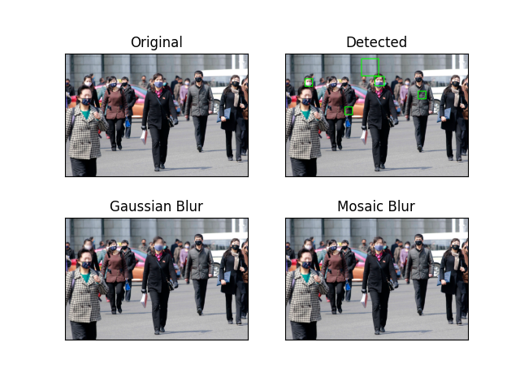
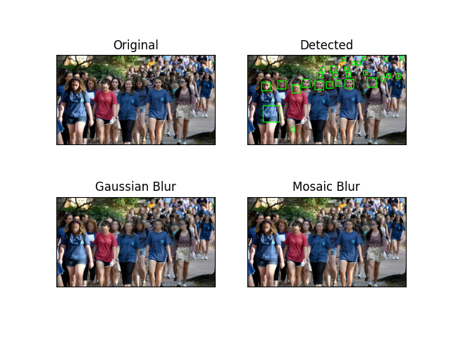
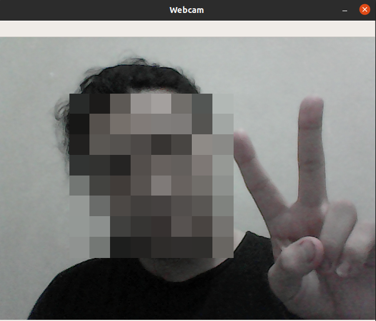

# Detects and Anonymize Face with OpenCV
## Description
This program is a face detection program and can anonymize the face. The background of this program is that lately, our faces are increasingly become "unsafe" on the internet, the potential for abuse is very high, especially if our faces are in public photos. Besides that, I also inspired by Google Maps Street View which can give a blur effect to every face detected in Street View.

This program has several features, including:
- Receive image input and assigns a bounding box to the detected face
- Receive image input and apply Gaussian Blur effect on detected faces
- Receive image input and apply Mosaic Blur effect on detected faces
- Receive real-time video input from webcam and apply Mosaic Blur effect on detected faces
- Receive video input and anonymize the detected faces per frame (Soon)
## Installation Guide
### Pull the Image
First, pull the image with this command

```docker pull zogojogo/anonymize_face:latest```

If the image has already been pulled, then run the anonymize container with this command. After that, we will be linked to the bash shell of the container.

Currently, this program just runs on Linux environment because there's still an issue in showing the figure. Before we run the container, we need to run this shell to enable the display environment.

```
xhost +local:docker \
XSOCK=/tmp/.X11-unix \ 
XAUTH=/tmp/.docker.xauth \
touch $XAUTH \
xauth nlist $DISPLAY | sed -e 's/^..../ffff/' | xauth -f $XAUTH nmerge -
```
If we already enable the display access. Then feel free to run the container with these commands.
```
docker run -it --rm \
           --env="DISPLAY" \
           --env="QT_X11_NO_MITSHM=1" \
           --volume="$XSOCK:$XSOCK:rw" \
           --device=/dev/video0:/dev/video0 \ 
           zogojogo/anonymize_face:latest 
```

If we are already in the bash shell and working directory, we can directly run the program. But before that maybe u can check the directory by the ```ls``` command. So there are a few options to run the program, we can choose whether to use images as the input or use our webcam as the input. The purpose is still the same to anonymize the detected faces. This is the main structure to run the program. 

``` python main.py <image/webcam mode> <image_path> <image_outputs> ```
### Images as Input
First, to use images as input mode we need to pass ```1```in the first argument after ```main.py```.

The second argument is the image path. You could manually download the image via ```Wget``` or ```curl``` but I already provide the samples to test the program. The sample images are provided in the repository so we can use them as input. There are 5 samples to try with the various situations, ```img1.jpg```, ```img2.jpg```, ```img3.jpg```, ```img4.jpg```, and ```img5.jpg```. 

The third argument is how the output will become. There are 4 options so I will break them down here.

- ```1``` will output the detected faces and the bounding box
- ```2``` will output the Gaussian Blur applied in the detected faces
- ```3``` will output the Mosaic Blur applied in the detected faces
- ```4``` will output all of them

So for the example to run the program is shown below :

```python main.py 1 img1.jpg 4```

### Webcam as Input
To use a webcam as the input we just pass ```2``` in the first argument and then pass zero value to the second and third argument. This feature is still buggy because we still need to pass the second and third arguments to run the program. But because it's still a demo so, better than nothing ;)

Command to run with webcam : 

```python main.py 2 0 0```

## Output Examples
### 1 Person with Image Input

### > 1 Person with Image Input



### Webcam Test
